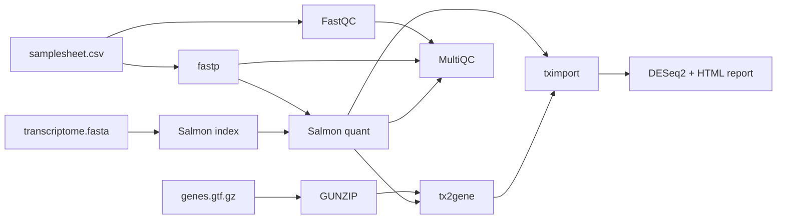

# phronexis/bulkrnaseqde

[](https://github.com/phronexisbio/phronexis-bulkrnaseqde/actions/workflows/nf-test.yml)
[](https://github.com/phronexisbio/phronexis-bulkrnaseqde/actions/workflows/linting.yml)
[](https://www.nf-test.com)
[](https://www.nextflow.io/)
[](https://github.com/nf-core/tools/releases/tag/4.0.2)
[](https://www.docker.com/)

[](https://doi.org/10.5281/zenodo.21258517)

A reproducible **bulk RNA-seq pipeline** that takes raw reads from a samplesheet through quality control, transcript quantification, and **differential expression**, and delivers a biologist-readable HTML report alongside standard QC. Built on the nf-core template, containerized, snapshot-tested, and launchable on Seqera Platform.

Its distinct contribution over `nf-core/rnaseq` is the **last mile**: it doesn't stop at a count matrix — it runs DESeq2 and renders a differential-expression report (PCA, volcano, top genes), the step `nf-core/rnaseq` deliberately leaves to the analyst.

> **Note on naming:** the pipeline is branded `phronexis/bulkrnaseqde` (the [Phronexis](https://phronexis.bio) project namespace) and hosted at [`github.com/phronexisbio/phronexis-bulkrnaseqde`](https://github.com/phronexisbio/phronexis-bulkrnaseqde). It is **not** an official nf-core pipeline; it reuses the nf-core template and modules under the Phronexis namespace.

---

## Screencast

<!-- TODO: embed or link the 60-second Seqera Platform launch + report screencast here -->

_A 60-second walkthrough of a monitored run on Seqera Platform — task graph, digest-pinned containers, and the differential-expression report — is available here: [link]._

---

## What it does

Given a **samplesheet** (sample IDs, conditions, FASTQ paths) and a **reference** (transcriptome FASTA + GTF annotation), the pipeline produces:

- a **merged gene-level count matrix**,
- a **MultiQC** report aggregating QC across all samples, and
- a **differential-expression HTML report** (PCA, volcano plot, top DE genes) readable without touching the command line.

### Pipeline steps

1. **Samplesheet validation** — schema-checked input including a `condition` grouping variable for downstream DE
2. **Read QC** — [FastQC](https://www.bioinformatics.babraham.ac.uk/projects/fastqc/) on raw reads
3. **Adapter/quality trimming** — [fastp](https://github.com/OpenGene/fastp)
4. **Quantification** — [Salmon](https://combine-lab.github.io/salmon/) (index + selective-alignment quant)
5. **Gene-level summarisation** — [tximport](https://bioconductor.org/packages/tximeta/) via a transcript-to-gene map built from the GTF
6. **Differential expression** — [DESeq2](https://bioconductor.org/packages/DESeq2/) (custom local module) → HTML report
7. **Aggregate QC** — [MultiQC](https://multiqc.info/)

## Architecture



## Quick start

Requirements: [Nextflow](https://www.nextflow.io/) ≥ 25.10.4 and [Docker](https://www.docker.com/).

```bash
# run the built-in test profile end-to-end on tiny data
nextflow run phronexisbio/phronexis-bulkrnaseqde \
    -profile test,docker \
    --outdir results
```

To run on your own data, provide a samplesheet and reference:

```bash
nextflow run phronexisbio/phronexis-bulkrnaseqde \
    -profile docker \
    --input samplesheet.csv \
    --transcript_fasta transcriptome.fasta \
    --gtf annotation.gtf.gz \
    --outdir results
```

### Samplesheet format

```csv
sample,fastq_1,fastq_2,condition,strandedness
CONTROL_REP1,control1_R1.fastq.gz,control1_R2.fastq.gz,control,reverse
CONTROL_REP2,control2_R1.fastq.gz,control2_R2.fastq.gz,control,reverse
TREATED_REP1,treated1_R1.fastq.gz,treated1_R2.fastq.gz,treated,reverse
TREATED_REP2,treated2_R1.fastq.gz,treated2_R2.fastq.gz,treated,reverse
```

The `condition` column is the grouping variable for differential expression and is **required**. DESeq2 needs **at least two replicates per condition**.

## Outputs

| Path                          | Description                                               |
| ----------------------------- | --------------------------------------------------------- |
| `multiqc/multiqc_report.html` | Aggregated QC across all samples                          |
| `tximeta/*.gene_counts.tsv`   | Merged gene-level count matrix                            |
| `deseq2/*.de_report.html`     | Differential-expression report (PCA, volcano, top genes)  |
| `deseq2/*.de_results.tsv`     | Full per-gene DE table (log2FC, p-value, padj)            |
| `pipeline_info/`              | Execution reports, software versions, RO-Crate provenance |

---

## Design decisions

This section documents _why_ the pipeline is built the way it is — the tradeoffs behind each choice.

### Salmon (selective alignment) over STAR (spliced alignment)

**Choice:** quantify with Salmon against a transcriptome, rather than aligning to the genome with STAR.

**Why:** Salmon is fast, memory-light, and produces transcript-level abundances directly suited to gene-level DE. For the standard "quantify known genes and test for differential expression" use case, it is the pragmatic default. STAR would be the better choice when you need **spliced genome alignment** — novel transcript/isoform discovery, variant calling, or inspecting alignments in a genome browser. This pipeline targets DE of a known annotation, so Salmon's tradeoff (no genome coordinates, but fast and accurate quantification) is the right one.

### fastp over Trim Galore

**Choice:** `fastp` for adapter/quality trimming (the `--trimmer` param also accepts `trimgalore`).

**Why:** fastp is fast, does adapter detection and quality trimming in one pass, and emits QC metrics that flow directly into MultiQC. Trim Galore is the older, widely-cited alternative; fastp is the modern default with less overhead.

### DESeq2 as a custom local module

**Choice:** the differential-expression step is a **local module** (`modules/local/deseq2/`) — code written for this pipeline — not an installed nf-core module.

**Why:** DE design is study-specific, so there is no one-size module. Writing it locally is deliberate: it owns the "last mile" that `nf-core/rnaseq` leaves to the analyst, and keeps the analysis logic (an R script wrapped in a Nextflow process) explicit and testable.

### Raw counts into DESeq2, not TPM

**Choice:** feed DESeq2 the plain gene counts, not TPM or length-scaled values.

**Why:** DESeq2 performs its own size-factor normalization internally. Handing it pre-normalized data (TPM, length-scaled counts) would double-normalize and distort the statistics. The tximport length-scaled matrix is rounded to integers to satisfy DESeq2's integer-count requirement — a standard pragmatic step when working from a pre-merged matrix.

### A `condition` column baked into the input schema

**Choice:** the samplesheet schema requires a `condition` column, beyond the standard `nf-core/rnaseq` columns.

**Why:** because this pipeline owns the DE step, it needs the grouping variable at input time. Baking `condition` into the schema means it is validated up front and flows through each sample's metadata to DESeq2 without a retrofit.

---

## Reproducibility

Reproducibility here is deliberate and, importantly, **honest about its limits**.

- **Containers are pinned.** The local DESeq2 container is pinned by **version and SHA-256 digest** (`bioconductor-deseq2:1.50.2--r45ha27e39d_0@sha256:de4543…`). All nf-core modules use their maintained biocontainer references, pinned by version and build hash. **No floating `:latest` tags appear anywhere.**
- **Tested at two levels.** A pipeline-level nf-test runs the whole workflow on tiny data; a module-level nf-test exercises the DESeq2 module in isolation against a committed count-matrix fixture. Both run in CI across two Nextflow versions.
- **Provenance is captured.** The nf-core RO-Crate (`ro-crate-metadata.json`) records how each run was configured.

**The honest limit:** snapshot tests assert output **structure and software versions**, not exact numeric content. DESeq2's floating-point results (and Salmon's quantification) are _not_ bit-identical across different hardware, even inside an identical, digest-pinned container — because numerical output depends on the host's math libraries (BLAS/LAPACK). Pinning the container guarantees the same _software_, not the same _last-decimal numbers_. Claiming otherwise would be false; the tests are designed around this reality rather than pinned to values that would flake.

## Known limitations

Stated deliberately — these are conscious scope boundaries, not oversights:

- **Bulk RNA-seq only.** Not single-cell (a different quantification and analysis regime).
- **Lightweight Salmon index (no genome decoy).** The test configuration builds a non-decoy index. A decoy-aware index (using the genome as decoy) improves quantification accuracy and is a config change — supply a genome FASTA as decoy — rather than a code change.
- **GTF handling.** The `tx2gene` step requires an uncompressed GTF; the pipeline decompresses gzipped input automatically (a `GUNZIP` step added after `tx2gene` was found to fail on gzipped annotation).
- **Standard two-group / factorial design.** The DE model is `~ condition`; it handles the common case cleanly rather than arbitrary complex designs (e.g. `~ batch + condition`) — extending the design formula is a documented next step.
- **Test data is minimal.** The built-in test uses a subsampled yeast dataset (124 genes, 2 replicates/group) — enough to prove the pipeline runs end-to-end, but underpowered by design. Real experiments use 3+ replicates and full annotations.

## What I'd change for production scale

- **Decoy-aware Salmon index** as the default, built from the genome once and reused.
- **Configurable DE design formula** (support covariates/batch) exposed as a parameter, plus shrinkage estimators (`apeglm`) for ranking by effect size.
- **A richer report** — gene-name annotation, GO/pathway enrichment, interactive plots — likely via a dedicated report container rather than base R, once the extra dependency weight is justified.
- **AWS Batch compute environment** on Seqera Platform for scale-out, with S3 work directories, replacing the local-compute demo used here.
- **Full-size test profile** (`test_full`) running a realistic dataset in CI on a schedule.

---

## Engineering notes

A few real problems solved during development, kept here because the debugging is part of the story:

- **Empty count matrix → gzipped GTF.** An initially-green run produced an empty matrix; traced from a Unicode decode error to `tx2gene` receiving a gzipped GTF it couldn't parse. Fixed by adding a `GUNZIP` step that accepts compressed or uncompressed annotation.
- **`-stub` produces empty outputs.** A stubbed run reports success without executing tools — a reminder that "pipeline completed successfully" is not "outputs are correct." All gate checks verify real artifacts, not just exit codes.
- **Salmon index as a value channel.** The index is built once and consumed by every sample; wiring it as a value channel avoids the "only the first sample quantified" bug.
- **Non-deterministic snapshots.** Salmon and DESeq2 outputs are not byte-stable across environments, so content snapshots were scoped to stable outputs (structure, versions) rather than volatile numeric files.

## Tech stack

| Concern                 | Tool                                              |
| ----------------------- | ------------------------------------------------- |
| Workflow engine         | Nextflow (DSL2, ≥ 25.10.4)                        |
| Template                | nf-core tools 4.0.2                               |
| Quantification          | Salmon 1.10.3                                     |
| Trimming                | fastp 1.1.0                                       |
| QC                      | FastQC 0.12.1 + MultiQC 1.34                      |
| Gene summarisation      | tximeta/tximport 1.20.1                           |
| Differential expression | DESeq2 1.50.2 (digest-pinned)                     |
| Testing                 | nf-test (pipeline + module level)                 |
| CI                      | GitHub Actions (lint + test, 2 Nextflow versions) |
| Cloud                   | Seqera Platform                                   |

## Credits

Developed by **[Phronexis](https://phronexis.bio)**. Built on the [nf-core](https://nf-co.re/) template and community modules.

## Citation

If you use this pipeline, please cite it via its Zenodo DOI:

> Phronexis. _phronexis/bulkrnaseqde: Bulk RNA-seq quantification and differential expression_. Zenodo. https://doi.org/10.5281/zenodo.21258517
